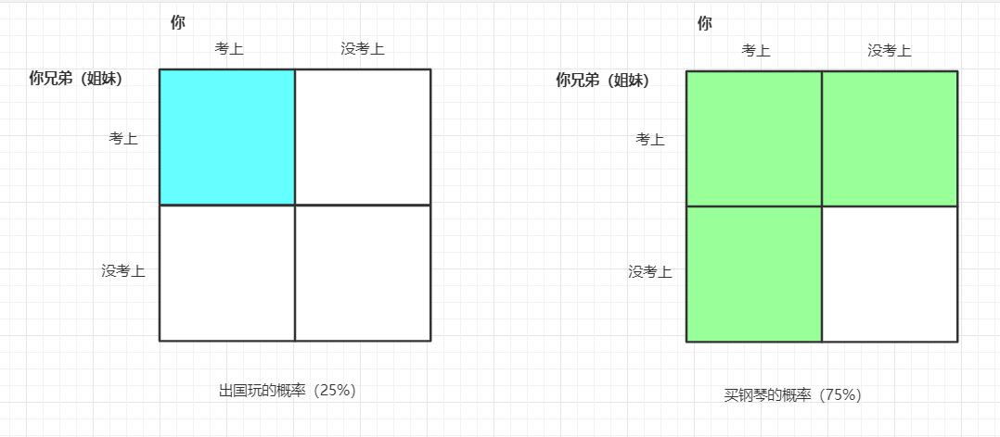
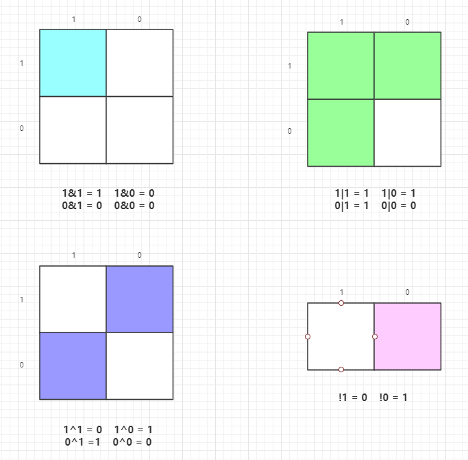
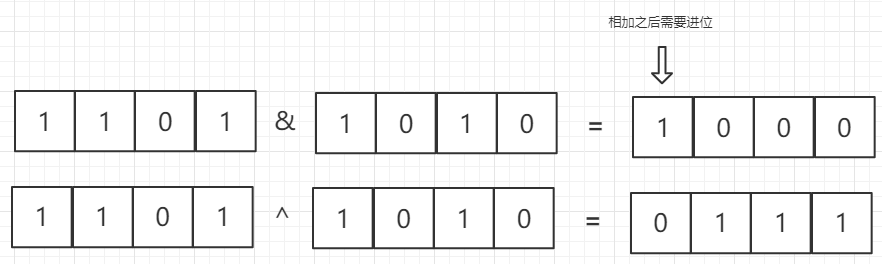
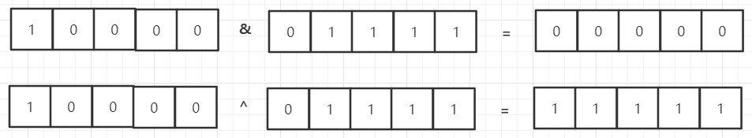
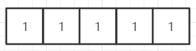
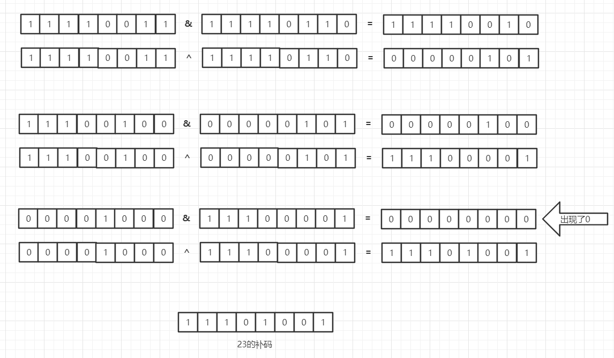

#问题(A + B 问题)

给出两个整数 a 和 b , 求他们的和。


#说明
a和b都是`32位`整数么？  
* 是的

我可以使用位运算符么？  
* 当然可以


#举例
####例 1:
    输入:  a = 1, b = 2  
    输出: 3	
    解释: 返回a + b的结果.
####例 2:
    输入:  a = -1, b = 1
    输出: 0	
    解释: 返回a + b的结果.

#挑战
显然你可以直接 return a + b，但是你是否可以挑战一下不这样做？（不使用`+`等算数运算符）

******
<font color=#0099ff size=12 face="黑体">开始解题</font>

##什么是与运算和或运算 ？  
先讲个故事，假如你有一个亲兄弟或者姐妹，你们两个人要一起参加高考，你们的父亲答应你们如果你与他（她）都考上清华就带你们去给国外玩。而你们的母亲答应只要你们两个中有一个考上清华，就给你们买架钢琴。但是你们只能在父母的两个承诺中选择一个，而你们毫不犹豫的选择了母亲。因为母亲的承诺实现起来的概率大。母亲的运算方法就是或运算！而父亲的是与运算。
如果还不明显，看一下这个图：

换成二进制就是:


<font color=#ff99ff size=4 face="黑体">这就是二进制与运算及或运算的原理</font>  

而所有计算机的数据都是以二进制存储的，只有`0`和`1`，不存在其他的数字，所以让我们看看加法是怎么实现的。
10进制中，我们都知道超9要进位，同样在计算机中超1就进位。但是就像你看到的位于左上角的与运算结果还是1，是不进位的。
所以，<font color=#ff99ff size=4 face="黑体">与预算及或运算都不进位！</font>  

我们来看看其他的逻辑运算符（与，或，异或，非）：
  
由此可以看到，<font color=#ff0000 size=4 face="黑体">与运算可以代替进位，异或运算可以代替不进位的加法。</font>所以我们就解决了，例如13+10：

<font color=#ff99ff size=4 face="黑体">与运算结果整体左移一位，因为两个结果都没有出现0，所以重复上面的操作</font>
  

<font color=#ff99ff size=4 face="黑体">虽然得到了结果，但是并不是我们要的结果，这是为什么？</font>
  
<font color=#ff0000 size=4 face="黑体">两个字：补码！</font>

###计算机的三种码
原码，反码，补码。
因为主要讲算法所以我们只需要知道：<font color=#ff99ff size=4 face="黑体">源码取反得反码，反码加一得补码</font>

知道了原理再看就清楚明白了：



##算法代码
C++
```buildoutcfg
class Solution {
public:
    /*
     * @param : An integer
     * @param : An integer
     * @return: The sum of a and b
     */
    int aplusb(int a, int b) {
        // write your code here
        if(a==0)
            return b;  
        if(b==0)
            return a;  
        int x1 = a ^ b;  
        int x2 = (a & b) << 1;  
        return aplusb(x1, x2);
    }
```
Python

```buildoutcfg
class Solution:
    """
    @param a: An integer
    @param b: An integer
    @return: The sum of a and b 
    """
    def aplusb(self, a, b):
        # write your code here
        import ctypes
        a = ctypes.c_int32(a).value
        b = ctypes.c_int32(b).value
        while b != 0:
            carry = ctypes.c_int32(a & b).value
            a = ctypes.c_int32(a ^ b).value
            b = ctypes.c_int32(carry << 1).value
        return a
```
