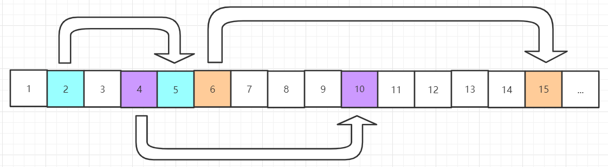

#问题(尾部的零)

设计一个算法，计算出n阶乘中尾部零的个数。

#举例
####例 1:
    输入: 11
	输出: 2
	
	样例解释: 11! = 39916800, 结尾的0有2个。
####例 2:
    输入: 5
	输出: 1
	
	样例解释: 5! = 120， 结尾的0有1个。
#挑战
O(logN)的时间复杂度


******
<font color=#0099ff size=12 face="黑体">开始解题</font>
 
常见的算法时间复杂度由小到大依次为：  
常用的for循环的嵌套是外层是O(n)，内层是n的2次幂。因此遍历的次数要比一次for循环还要小，即要跳跃着遍历参数。

观察到是阶乘，所以看看哪些能用乘法组成10，如图所示：



10是由2和5相乘得到的，而偶数较多，所以只要找5的倍数即可。


##算法代码
C++
```buildoutcfg
class Solution {
public:
    /*
     * @param n: A long integer
     * @return: An integer, denote the number of trailing zeros in n!
     */
    long long trailingZeros(long long n) {
        // write your code here, try to do it without arithmetic operators.
        if (n == 0)
        {
            return 1;
        }
        if(n > 0 && n < 5)
        {
            return 0;
        }else{
            return (n/5 + trailingZeros(n/5));
        }
    }
};
```
Python

```buildoutcfg
class Solution:
    """
    @param: n: An integer
    @return: An integer, denote the number of trailing zeros in n!
    """
    def trailingZeros(self, n):
        # write your code here, try to do it without arithmetic operators.
        if n == 0:
            return 1;
        x = 0
        while n > 5:
            x += n // 5
            n = n // 5
        return x
```
